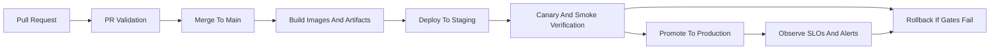

# CI/CD And Ops Playbook

This document defines the release flow, operational checks, and incident response patterns for the platform upgrade.

## Delivery Principles

1. Every change is traceable to code, config, and environment.
2. No model or service ships without validation gates.
3. Rollback must be simpler than rollout.
4. Data and contract validation happen before runtime wherever possible.

## Required CI Workflows

### Pull Request Validation

Run on every PR:

- Python lint and format checks
- frontend lint and build
- backend unit tests
- API contract tests
- event schema tests
- dependency vulnerability scan
- Docker image build smoke test

Required result:

- PR cannot merge if any contract, test, or security gate fails

### Main Branch Validation

Run on merge to `main` or release branches:

- full backend test suite
- full frontend build
- integration tests against ephemeral database and Redis
- Terraform format and validate
- container image build and tag

Required result:

- successful main build produces immutable build artifacts and image tags

### Nightly Jobs

Run every night:

- data quality checks on recent ingest
- anomaly-rate sanity report
- stale-job scan
- drift checks on monitored features

### Weekly Jobs

Run every week:

- model evaluation report on the latest labeled data
- dependency freshness report
- backup restore rehearsal for key data stores

## Recommended Release Flow

## Deployment Gates

Before staging:

- tests pass
- contracts pass
- images build
- migrations validated

Before production:

- staging smoke checks pass
- API and websocket health checks pass
- no critical alert from observability stack
- on-call owner acknowledges release window

## Rollback Rules

Trigger rollback when:

- error rate exceeds release threshold
- ingest job failures spike above baseline
- anomaly event output drops unexpectedly
- notification delivery drops below agreed threshold
- community overview generation fails repeatedly

Rollback assets:

- previous container image
- previous model registry version
- previous infrastructure plan
- previous config set

## Recommended SLO Dashboard Set

Service dashboards:

- API latency and error rate
- websocket freshness
- ingest queue backlog
- worker throughput
- DB write latency
- Kafka lag

ML dashboards:

- anomaly volume by station
- anomaly precision on reviewed incidents
- drift indicators
- forecast latency and forecast freshness

Product dashboards:

- incident acknowledgment time
- community summary generation time
- notification delivery outcomes

## Incident Playbooks

### 1. Ingest Pipeline Stalled

Symptoms:

- queue backlog grows
- job completion drops
- no new readings arrive

Immediate actions:

- inspect worker health
- inspect queue depth
- inspect source endpoint failures
- fail open on raw archive, fail closed on corrupted summaries

Recovery target:

- restore ingest within agreed RTO

### 2. Anomaly Spike

Symptoms:

- anomaly rate jumps across many stations

Immediate actions:

- check source quality and schema drift
- compare input distributions to last 24-hour baseline
- inspect the active model version
- verify whether this is a real environmental event

Recovery target:

- classify issue as real event, data defect, or model regression within one response window

### 3. Drift Alert Fired

Symptoms:

- feature distributions or prediction distributions moved beyond threshold

Immediate actions:

- inspect drift dashboard
- compare current and previous model behavior
- run evaluation on recent labels
- decide whether to retrain, revert, or monitor

### 4. Forecast Service Stale

Symptoms:

- forecasts are older than freshness SLA

Immediate actions:

- inspect scheduled jobs
- inspect feature-generation lag
- inspect registry lookup and model loading

### 5. Notification Delivery Failure

Symptoms:

- delivery success rate drops

Immediate actions:

- inspect channel provider
- inspect queue retries
- inspect routing and subscription filters
- switch to fallback channels for critical alerts if policy allows

## Minimum Tooling Standard

- GitHub Actions or equivalent for CI/CD
- artifact registry for images
- Terraform plan and apply workflows
- OpenTelemetry collectors
- Prometheus and Grafana
- centralized logs
- MLflow registry

## What Not To Do

- do not deploy directly from a local machine
- do not release new models without evaluation artifacts
- do not hide failed data validations
- do not let staging drift far from production behavior
