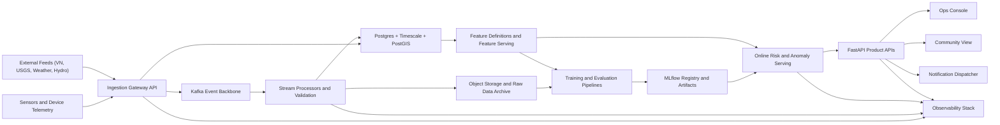

# FAANG-Grade Target Architecture

This document defines the target platform for `AnomalyGuard` if the goal is to operate it like a serious, scalable ML product rather than a single demo application.

The goal is not to add complexity for prestige. The goal is to make the system reproducible, observable, safe to evolve, and capable of handling real operational load across multiple deployments.

## Upgrade Principles

1. Keep the current product alive while upgrading it.
2. Prefer clear seams and contracts before splitting services.
3. Version code, data, models, and infrastructure.
4. Push decisions to configuration or deployment data where possible.
5. Treat observability, rollback, and security as first-class product features.
6. Keep the community layer public-safe and separate from operator-only controls.

## Current Starting Point

The repo already has the right ingredients for a serious platform:

- FastAPI API with WebSockets
- PostgreSQL/Timescale-style storage
- Celery workers
- Kafka hooks for alert publishing
- Prometheus metrics
- MLflow dependency for model lifecycle tracking
- community and operator routes
- incident lifecycle
- deployment-specific impact profiles

The main gaps are platform maturity gaps, not idea gaps:

- CI currently compiles backend and builds frontend, but does not run meaningful test suites
- ingest jobs still block API requests on `task.get(...)`
- Docker Compose is still local-first
- Terraform is still Docker-local, not cloud-targeted
- there is no strong contract between ingest, events, training, and serving
- model lifecycle and drift response are still mostly aspirational

## Target Platform Shape

## Logical Layers

### 1. Edge and Ingestion Plane

Responsibilities:

- accept device telemetry
- accept external feed ingestion requests
- validate schemas and auth
- assign idempotency keys
- emit raw events

Recommended shape:

- `FastAPI` remains the ingestion edge in early phases
- every ingest path writes an event envelope with `event_id`, `source`, `tenant`, `station_id`, `ingested_at`, and `schema_version`
- long-running ingestion becomes job-based, not request-blocking

### 2. Stream and Storage Plane

Responsibilities:

- raw event validation
- normalization
- enrichment
- anomaly pipeline input preparation
- durable storage

Recommended shape:

- `Kafka` becomes the event backbone
- `Postgres + Timescale + PostGIS` remains the system of record
- object storage keeps raw payload archives and training snapshots
- dead-letter topics catch bad payloads without dropping them silently

### 3. Feature and ML Plane

Responsibilities:

- build features consistently for training and serving
- train anomaly and forecast models
- log runs, artifacts, and metrics
- promote and roll back model versions

Recommended shape:

- keep the current detector as the initial champion
- add forecasting separately from anomaly detection
- move to explicit feature definitions before adding a full feature store
- promote models through `MLflow` registry states
- add drift monitoring before adding exotic online-learning approaches

### 4. Product and Serving Plane

Responsibilities:

- expose operator-safe APIs
- expose community-safe APIs
- serve explanations, incidents, profiles, and forecasts
- deliver realtime events to UI and notifications

Recommended shape:

- keep `FastAPI` as the public product surface
- split domains inside the codebase first:
  - `api/ops`
  - `api/community`
  - `api/device`
  - `api/incidents`
  - `api/jobs`
  - `api/admin`
- later, break out separate deployable services only when load or team boundaries justify it

### 5. Control Plane and Platform Operations

Responsibilities:

- CI/CD
- secrets
- deployment orchestration
- runtime policies
- observability

Recommended shape:

- Docker remains the packaging standard
- Kubernetes becomes the medium-term runtime target
- Terraform manages cloud resources, networking, queues, databases, and secrets bindings
- OpenTelemetry, Prometheus, centralized logs, and traces become non-optional

## Data and Event Contracts

Every major event should have an explicit contract:

- `reading.ingested.v1`
- `telemetry.received.v1`
- `anomaly.detected.v1`
- `incident.updated.v1`
- `risk.forecast.generated.v1`
- `community.summary.generated.v1`

Each contract should define:

- schema version
- tenant or deployment scope
- station or zone identifiers
- event time and ingest time
- provenance metadata
- idempotency key

## Recommended Storage Model

Keep one strong operational database before over-splitting:

- `Postgres + Timescale + PostGIS`
  - readings
  - alerts
  - incidents
  - stations
  - zones
  - assets
  - subscriptions
  - job records
  - labeling and review records

Add object storage for:

- raw source payload archives
- training datasets
- model artifacts
- exported reports

This is enough to reach a strong platform baseline before introducing more stores.

## Model Lifecycle

### Anomaly Detection

- champion model starts as the current hybrid detector
- challenger models can include improved tree models, temporal models, or unsupervised ensembles
- all models must emit comparable outputs:
  - score
  - severity
  - top signals
  - structured explanation fields

### Forecasting

- forecasting is a separate pipeline, not mixed into the realtime detector
- first useful horizons:
  - 6 hours
  - 12 hours
  - 24 hours

### Review and Feedback

- operators should label:
  - true anomaly
  - false positive
  - expected event
  - unresolved
- those labels feed retraining and evaluation datasets

## Observability Model

### Service SLIs

- ingest success rate
- ingest lag
- anomaly detection latency
- job completion rate
- websocket freshness
- API p95 latency
- notification delivery success rate

### ML SLIs

- anomaly rate by source and station
- label-confirmed precision
- label-confirmed false-positive rate
- drift indicators on important features
- forecast error by horizon

### Required Tooling

- `Prometheus` for metrics
- `Grafana` for dashboards
- OpenTelemetry for traces
- centralized structured logs
- alerting on SLO violations

## Security and Compliance Baseline

- JWT/OAuth for operator APIs
- device-key rotation for telemetry clients
- secrets out of repo and into secret managers or platform secrets
- audit trail for incident state changes and administrative actions
- dependency scanning in CI
- role separation between operator, admin, and public community access

## Deployment Strategy

### Near Term

- modular monolith with stronger boundaries
- Docker images for all components
- staging environment that mirrors production paths

### Medium Term

- Kubernetes for API, workers, consumers, and scheduled jobs
- managed Kafka, managed Postgres/Timescale-compatible service, managed Redis
- Terraform modules for repeatable environments

### Long Term

- multi-tenant isolation
- regional deployment profiles
- backup and disaster-recovery playbooks

## Deliberate Non-Goals For Early Phases

These can come later if the product truly needs them:

- Flink-first stream processing
- feature store before feature definitions are stable
- active-active multi-region deployment
- fully split microservices for every domain
- advanced online-learning stacks

The right path is a disciplined platform evolution, not immediate maximum complexity.
